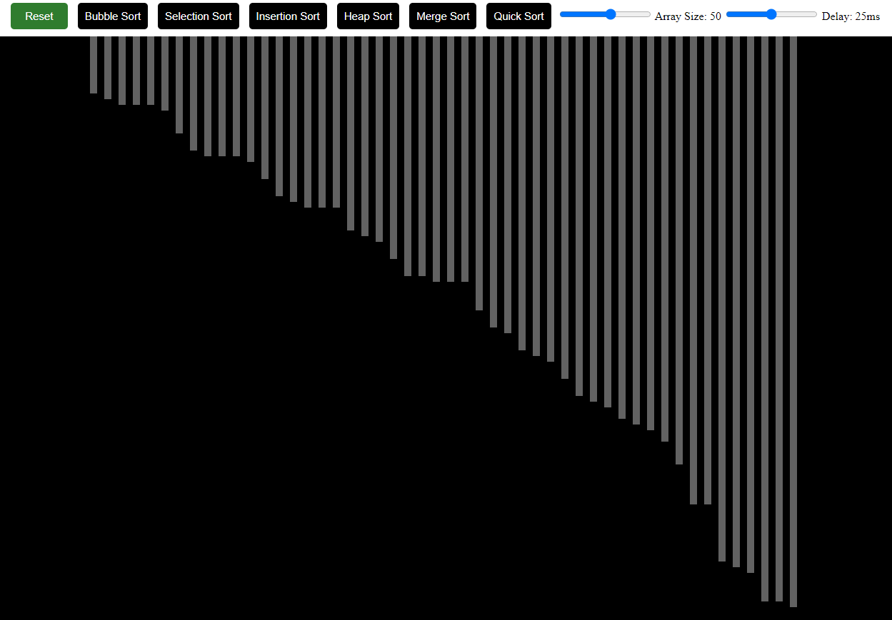

# Sorting Visualizer

[Demo Link]()

This program generates a random set of numbers and sorts them using the following sorting algorithms:

- Bubble sort
- Selection sort
- Insertion sort
- Heap sort
- Merge sort
- Quick sort

